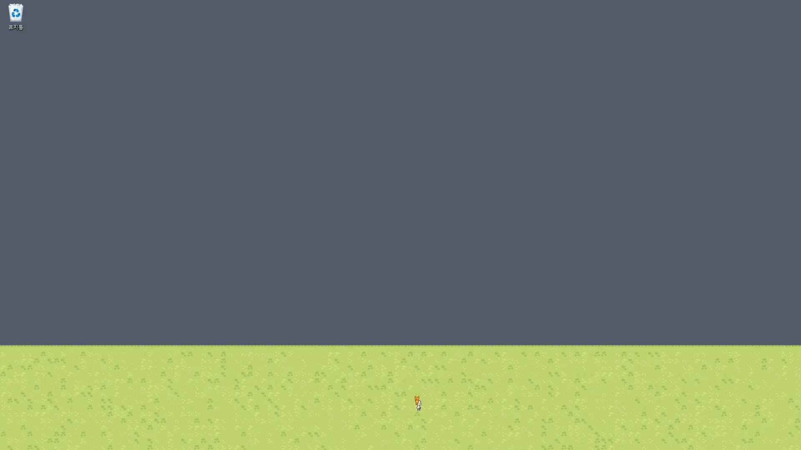

  

# Idleama

A custom idle diorama that moves at the bottom of your PC desktop screen.

Idleama, a combination of 'Idle' and 'Diorama', is an application that lets you place your own custom characters on the bottom of your desktop to watch them move. It's designed for users who want to personalize their desktop in their own style.

This project is currently in its **Alpha version**, with only Minimum Viable Product (MVP) features implemented.

## ✨ Features

* **Complete Customization**: Bring your own custom-formatted sprite sheets to life on your desktop.
* **Idle Action**: Positioned at the bottom of the screen, characters move on their own without requiring any user interaction.
* **Future Updates Planned**: Various features such as user interaction, an affinity system, and time-spent tracking are planned for future releases.

## 🖼️ Screenshots

## 🚀 Getting Started

### System Requirements

* **Windows 10 or later**

### Installation (Alpha Version)

1.  Go to the [Releases](https://gitlab.com/markab.j.nn/Idleama/-/releases).
2.  From the `Assets` list of the latest version, download the installer file that matches your operating system (e.g., `Idleama_x.x.x_x64_setup.exe`).
3.  Run the downloaded installer.

## 📖 Documentation

For more details on how to add and configure character packs, please refer to the documentation below.

*   [한국어](./docs/USAGE.ko.md)
*   [English](./docs/USAGE.en.md)
*   [日本語](./docs/USAGE.ja.md)

## 🤝 Contributing

This project is currently in the early stages of development. The contribution policy will be updated in the future.

## 📜 License

This project is distributed under the MIT License. See the `LICENSE` file for more details.
